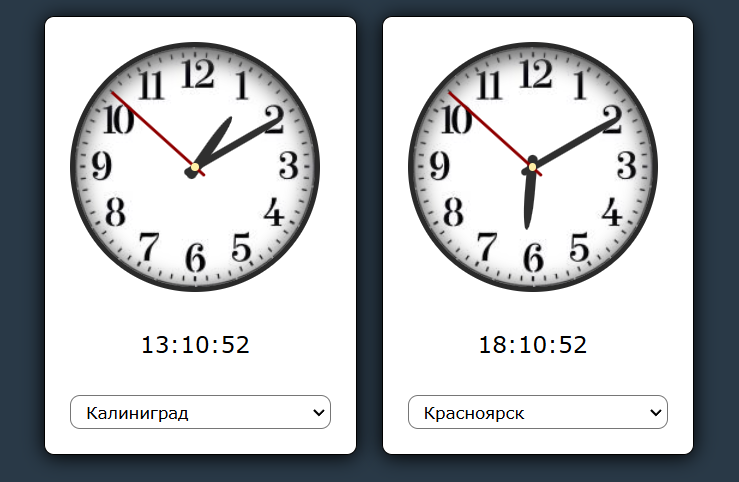

# Часы с выбором часовых поясов

Это приложение является [тестовым заданием](https://github.com/Voodo13/timezones-clock-test/blob/master/task.pdf)
стек: react, redux-toolkit, sass, webpuck



## Запуск приложения

Скачать zip архив с репозитория GitHub и распаковать, либо выполнить в консоли:

```
git clone https://github.com/Voodo13/timezones-clock-test.git
cd timezones-clock-test
npm install
npm start
```

Далее перейти по ссылке [http://localhost:3000/](http://localhost:3000/)

### Сборка проекта

```
npm run build-prod
```

Проект будет собран в /dist

### Настройки

- часовые пояса подгружаются из `./public/timezones.json`
- количество часов на экране по умолчанию 2, изменить можно в `./index.js`

```js
//imdex.js
...
const CLOCK_COUNT = 2;
...
```

### Краткое описание

Приложение старался сделать с расчетом на расширение, поэтому каждый виджет часов принимает пропсами пачку таймзон и объект `Date()`

Текущее время сделал общим, так как иначе при установке таймаутов для каждого отдельного виджета, при изменении часового пояса был рассинхрон картинки +/- секунда, лечилось уменьшением времени таймаута, но ререндер по 10 раз в секунду мне моказался излишним.

Также не стал выносить стейт времени во внешний стор, так как небыло необходимости глубого прокидывать в компоненты.

Таймзоны вынесены в редакс только по тому что в ТЗ тебовался редакс, изначально хотел вынести их в общий хук `./src/hooks/useDate.jsx`.

По хорошему еще надо загрузку таймзон вынести в отдельный сервис, что-то типа `./src/api/timezoneService.js`
